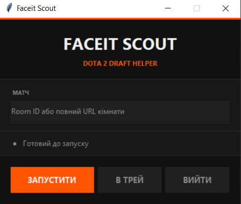

# Faceit Scout — Аналізатор драфту Dota 2

Легкий десктопний застосунок і веб-інтерфейс для піку гравців на Faceit у Dota 2.  
Показує ранг, основну позицію, Faceit ELO/рівень кожного гравця та посилання на OpenDota — все завантажується паралельно.

> **[⬇ Завантажити FaceitScout.exe (v1.0.0)](https://github.com/Chasil1/faceit-scout/releases/download/v1.0.0/FaceitScout.exe)** — запускається без встановлення Python

---

## Як користуватись

Після запуску `FaceitScout.exe` відкриється ось такий інтерфейс:



1. Скопіюйте посилання на кімнату Faceit або лише ID:
   - Повне посилання: `https://www.faceit.com/uk/dota2/room/1-e84bbbbb-1e1c-4641-af94-a4d910581117`
   - Або лише ID: `1-e84bbbbb-1e1c-4641-af94-a4d910581117`
2. Вставте у поле та натисніть **ЗАПУСТИТИ**.

> **Увага:** у десктопному застосунку `Ctrl+V` працює лише при **англійській розкладці клавіатури**.  
> Як обійти: натисніть **ВІДКРИТИ** — браузер відкриється на `http://127.0.0.1:8000`, де можна вставити посилання через `Ctrl+V` при будь-якій розкладці.  
> Також у полі введення доступне **праве кліком → Вставити**.

---

## Функціонал

- **Пошук матч-кімнати** — вставте Room ID або повне посилання на кімнату, щоб миттєво завантажити обидві команди
- **Ранг Dota 2** — отримується з OpenDota (від Herald до Immortal з позицією в leaderboard)
- **Основна та додаткова позиція** — розраховується за останніми 20 матчами на основі ролі лінії та GPM
- **Faceit ELO та рівень** — отримується з Faceit Data API
- **Іконки рангів** — зображення сезонних медалей Dota 2 відображаються прямо в картці гравця
- **Значок капітана** — виділяє капітана команди в кожному складі
- **Режим драфту** — коли матч у статусі `CAPTAIN_PICK`, інтерфейс перемикається на триколонковий вигляд: капітан ліворуч, капітан праворуч, спільний пул гравців відсортований за рангом у центрі
- **Live оновлення** — під час активного драфту застосунок опитує сервер кожні 15 секунд і автоматично підтягує дані OpenDota для нових гравців (з локальним кешем для уникнення повторних запитів)
- **Сортування за рангом** — гравці відсортовані від найвищого рангу до найнижчого всередині кожної команди
- **Системний трей** — згорніть лаунчер у трей Windows; двічі клацніть або скористайтесь меню трею для відновлення
- **Один екземпляр** — Windows Mutex запобігає запуску кількох копій одночасно
- **Темний інтерфейс** — і лаунчер (Tkinter), і вебсторінка використовують однакову темну кольорову схему

---

## Вимоги

- **Python 3.10+**
- Залежності з `requirements.txt`:

```
aiohttp>=3.9
rich>=13.0
fastapi>=0.110
uvicorn>=0.29
pystray>=0.19
pillow>=10.0
```

---

## Запуск без збірки (через Python)

1. **Клонуйте або завантажте** репозиторій.

2. **Встановіть залежності:**
   ```bash
   pip install -r requirements.txt
   ```

3. **Запустіть GUI-лаунчер:**
   ```bash
   python launcher.py
   ```

4. З'явиться вікно лаунчера. Натисніть **ЗАПУСТИТИ** (або Enter після вставки Room ID/URL).  
   Веб-інтерфейс відкриється автоматично у браузері за адресою `http://127.0.0.1:8000`.

> Також можна запустити сервер напряму без GUI:
> ```bash
> python server.py
> ```
> Потім відкрийте `http://127.0.0.1:8000` вручну.

---

## Збірка .exe

Проєкт використовує [PyInstaller](https://pyinstaller.org/) із попередньо налаштованим spec-файлом.

### Швидка збірка (Windows)

Двічі клацніть `build.bat` або запустіть його з терміналу:

```bat
build.bat
```

Скрипт автоматично:
1. Встановить PyInstaller командою `pip install pyinstaller`
2. Виконає `pyinstaller faceit_scout.spec --clean`
3. Збереже готовий файл у `dist\FaceitScout.exe`

### Ручна збірка

```bash
pip install pyinstaller
pyinstaller faceit_scout.spec --clean
```

Spec-файл пакує:
- `launcher.py` як точку входу
- `index.html` та папку `photo/` (зображення медалей рангів) як дані
- Усі необхідні приховані імпорти для uvicorn, anyio, pystray і Pillow

Результат — **одиночний `.exe`-файл** (`console=False`, без вікна терміналу), який працює повністю автономно — Python на цільовому комп'ютері не потрібен.

---

## Структура проєкту

```
faceit-checker/
├── launcher.py          # GUI-лаунчер на Tkinter + керування uvicorn-сервером
├── server.py            # FastAPI бекенд (API-ендпоінти матчу та гравців)
├── faceit_checker.py    # CLI-утиліта (таблиця у терміналі через Rich)
├── index.html           # Веб-інтерфейс (односторінковий, vanilla JS)
├── photo/               # Зображення медалей рангів Dota 2 (.webp)
├── requirements.txt     # Залежності Python
├── faceit_scout.spec    # Spec-файл PyInstaller для збірки
└── build.bat            # Скрипт збірки одним кліком (Windows)
```

---

## API-ендпоінти

| Метод | Шлях | Опис |
|-------|------|------|
| `GET` | `/` | Віддає `index.html` |
| `GET` | `/api/match/{room_id}` | Повні дані матчу — обидві команди з рангами та позиціями |
| `GET` | `/api/match/{room_id}/poll` | Легкий опит — лише дані Faceit, без OpenDota |
| `GET` | `/api/player/{player_id}` | Повні дані одного гравця за Faceit player ID |

---

## Використання CLI

Для роботи лише в терміналі без GUI та вебсервера:

```bash
# За Room ID матчу
python faceit_checker.py --match 1-20ca85e4-1574-4705-b8b4-d1dce9938484

# За нікнеймами або посиланнями на профілі
python faceit_checker.py --players Player1 Player2 Player3
```

Виводить таблицю Rich з нікнеймом Faceit, рангом Dota 2, основною позицією та посиланням на OpenDota.

---

## Автор

Створено **[Chasil](https://steamcommunity.com/id/Chasil/)**
